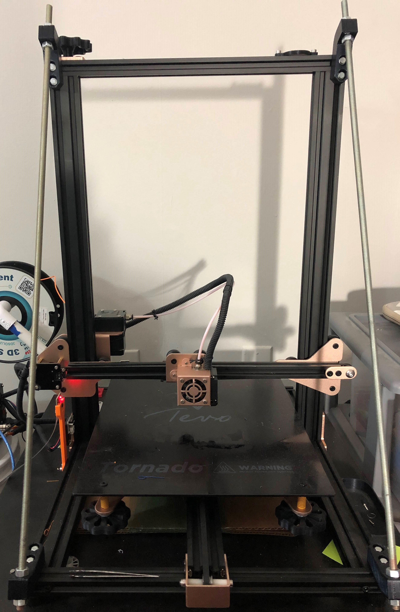

# Projects
### (Page Under Development)
Some of the projects I have worked on, and the ones I am currently tackling.

## Mason Jar  Bioreactor V1
Created as part of the final project for my Instrumentation class

First functional mason jar reactor

Closeup of vessel with E. Coli expressing RFP

## Mason Jar Bioreactor V2

Second reactor version utilizing an Arduino Uno for temperature control
 # Goals were:
 1. Sterilizable by autoclave
 2. Easily dissasembled for educational use
 3. Made from easily obtained parts
 4. Used to teach about microbiology, biochemical engineering, and electronics

Quart reactors with E. coli expressing different colors

Same reactors under blacklight

Extracted GFP from reactors that has been polymerized under blacklight. Shaped using a 3D printed dogbone mold.

## Raspberry Pi Chemostat

# Goals
1. Maintain cells in their optimal growth phase by exchanging media
2. Measure Optical Density
3. Measure pH (optional control)
4. Sterilizable by autoclave
5. Web browser based control
6. Easily sourced parts

Vessel Connected to the tower. Tower is 3D printed.

3 peristaltic pumps and the air pump

Inside the vessel lid. 4 Sample ports, Sparge stone, thermowell, and heater

Current parameters on the screen

Side of the tower with the Optical Density module, and the electrical connections

Assembled vessel

Progression of the reactor vessels. (Left to right) V1, V2 pint, V2 quart, and the chemostat vessel

## Bioprinter

Bioprinter converted from a i3 clone. 3D printed syringe pump connected on the left side to pump viscous fluids instead of plastics.

Syringe pump was built following this paper. https://www.sciencedirect.com/science/article/pii/S2468067217300822

Glass dish adhered to bed, filled with a gelatin slurry for support of the printed item.

## Stand Alone Syringe Pump

Stand alone 3D Printed syringe pump

Link to github with build details.
https://github.com/FOSH-following-demand/Syringe_Pump

## R. Palustrus Scale Up

## Current 3D Printer (Tevo Tornado)

## (Active Project) Syringe pump V2 (for bioprinter)

# Goals
1. Reduce backlash from previously built pump
2. Allow for alternate syringe sizes
3. Belted drive reduction to reduce noise from 3D printed gears

## (Active Project) Building and learning how to use my Workbee 1010 CNC

